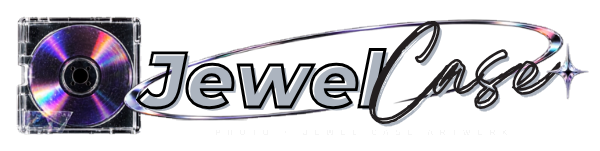

<p align="center">
  
</p>

Turn any photo into Y2K-inspired jewel-case / CD artwork directly in the browser.

## Features

- Drag-and-drop photo upload
- Supplied photorealistic jewel-case template used as the physical case/disc base
- Photo compositing calibrated to the template's disc and hub geometry
- Clear, purple, smoke, black, pink, and iridescent disc finishes
- Spin/motion blur simulation
- Brightness, contrast, saturation, zoom, rotation, and drag positioning
- Crystal-clear, worn, and minimal jewel-case treatments
- Procedural disc grooves, glare, grain, dust, and plastic scratches
- Optional album-title, price, parental-advisory, and barcode stickers
- 1080, 2048, and 4096 px export
- PNG or JPG download
- Fully local processing: uploaded photos never leave the browser
- No dependencies, no build step, no backend

## Run locally

Open `index.html` in a modern browser.

For a local server, you can also run:

```bash
python3 -m http.server 8080
```

Then visit `http://localhost:8080`.

## GitHub Pages

This repository includes a GitHub Pages deployment workflow. After Pages is enabled for the repository, pushes to `main` deploy automatically.

Expected site URL:

**https://cgvlpl.github.io/JewelCase/**

## How it works

JewelCase uses the browser Canvas 2D API. The supplied photographed empty jewel case provides the real acrylic rails, hinge, disc reflections, hub, scratches, dust, and material response. Uploaded artwork is masked into the disc and composited with blend modes so those photographed details remain visible, then optional tint, grooves, aging, and labels are added. Export is rendered again at the selected full resolution rather than simply scaling the preview.

## Privacy

Image processing is client-side. No photo data is sent to a server by this app.

## License

MIT
